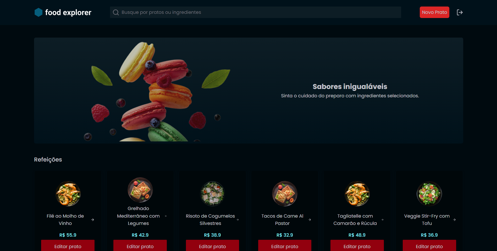

# FoodExplorer - Back End

In this repository you can acess the backend code of the FoodExplorer project. It's a full stack project that consists in a restaurant website where you can list, add, remove and update your company dishes. You can set a title, a price, a description and some ingredients that will help your clients see your products and buy the dishes you cook. Feel free to use this project for your own purposes.

## ✨ Live Preview

You can access the live preview clicking [here]().

## Preview



## 🚀 How can I set up the backend?

First of all, clone the project in your computer.

```bash
  git clone git@github.com:gustavogarciac/foodexplorer-backend.git
```

---

### 💫 Running the back-end

```bash
  // In Backend insert a port and a auth secret on the .env file
    AUTH_SECRET=
    PORT=

  // Install necessary dependencies
  $ npm install

  //Run the server
  $ npm run dev

```

## 🚀 Technologies

- NodeJS
- Express
- JavaScript
- Bcryptjs
- Cors
- Dotenv
- Express-Async-Errors
- JWT
- Multer
- Knex
- Sqlite
- Nodemon

## 💻 Copywright

Feel free to use this material to your own projects. Keep studying, we can change the world!
